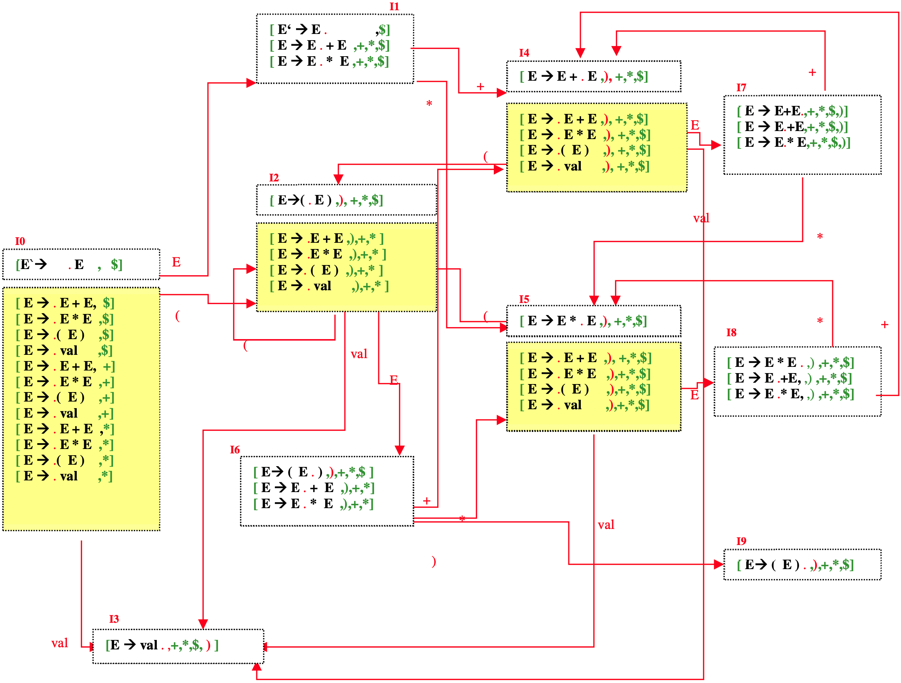

# Makefile

### `make [debug=true]`
Generates binary files (.o) and the project executable "main".
Activate the debug mode with "debug=true".

### `make run`
Generates the executable if it does not already exist, and executes it.

### `make rebuild [debug=true]`
Force deletion of files to rebuild them.
Activate the debug mode with "debug=true".

### `make clean`
Delete binary files.

### `make clean`
Deletes the binary files and the "main" executable


# Requirements

C++ version 11.


# Example of execution

### No debug
`make run`    
```
Do you want to support negative integers ? Y/N 
> Y
Support for negative integers enabled.
Enter an expression to compute or 'stop': 
> (4+6)*10+2+-60
Result: 42
Enter an expression to compute or 'stop': 
> stop
Ending the process
```

### With debug=true
`make run`
```
Do you want to support negative integers ? Y/N 
N
Support for negative integers disabled.
Enter an expression to compute or 'stop': 
3*3+3
Transiting through the state I0
With symbol:
    INT
Transiting through the state I3
With symbol:
    MULTIPLICATION
Transiting through the state I0
With symbol:
    EXPR
Transiting through the state I1
With symbol:
    MULTIPLICATION
Transiting through the state I5
With symbol:
    INT
Transiting through the state I3
With symbol:
    PLUS
Transiting through the state I5
With symbol:
    EXPR
Transiting through the state I8
With symbol:
    PLUS
Transiting through the state I0
With symbol:
    EXPR
Transiting through the state I1
With symbol:
    PLUS
Transiting through the state I4
With symbol:
    INT
Transiting through the state I3
With symbol:
    END
Transiting through the state I4
With symbol:
    EXPR
Transiting through the state I7
With symbol:
    END
Transiting through the state I0
With symbol:
    EXPR
Transiting through the state I1
With symbol:
    END
Result: 12
Enter an expression to compute or 'stop': 
stop
Ending the process
````


# States schema




